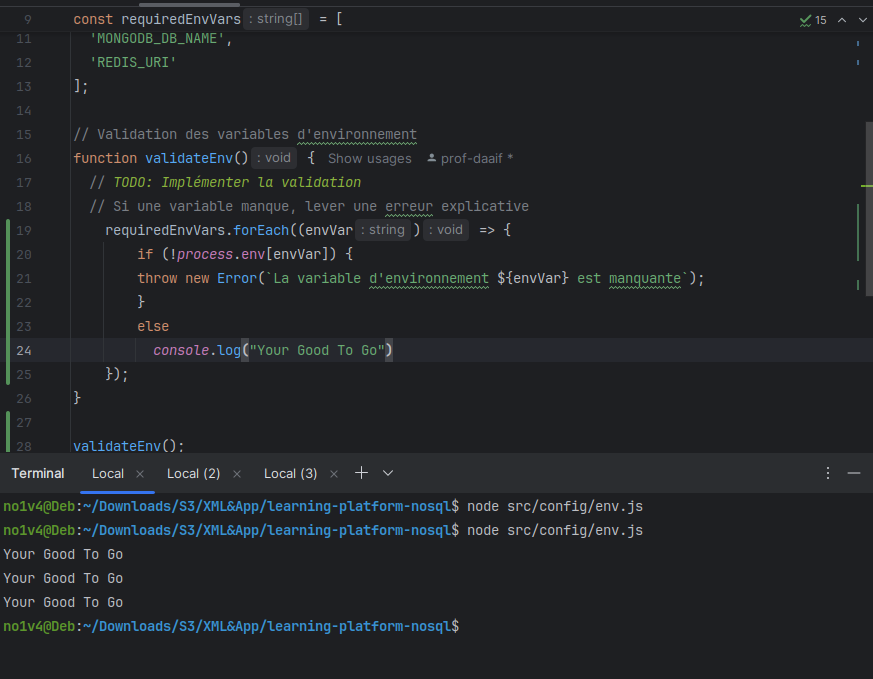
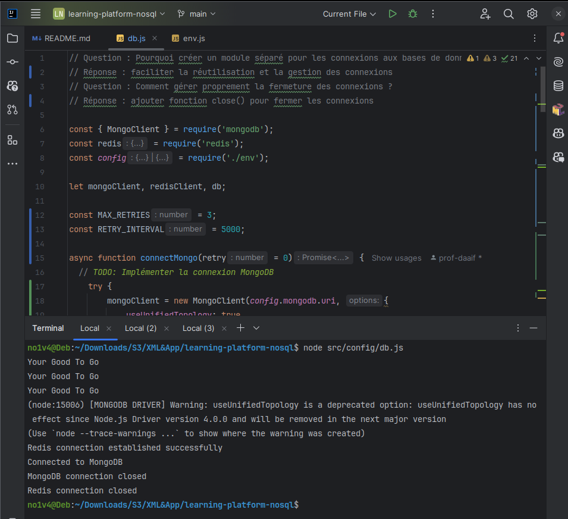
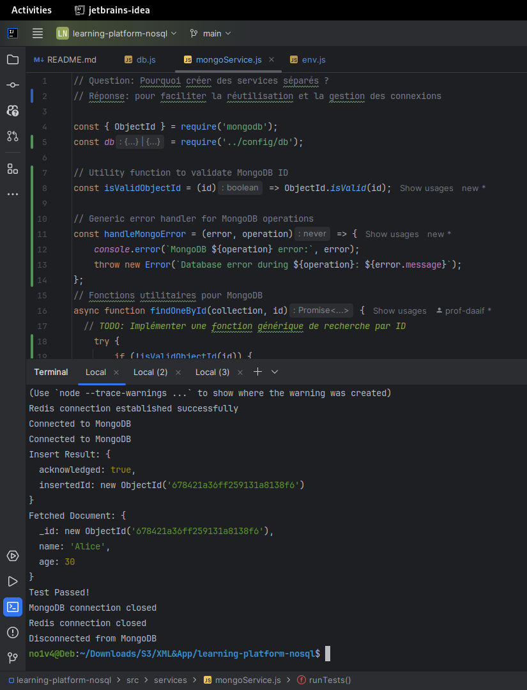
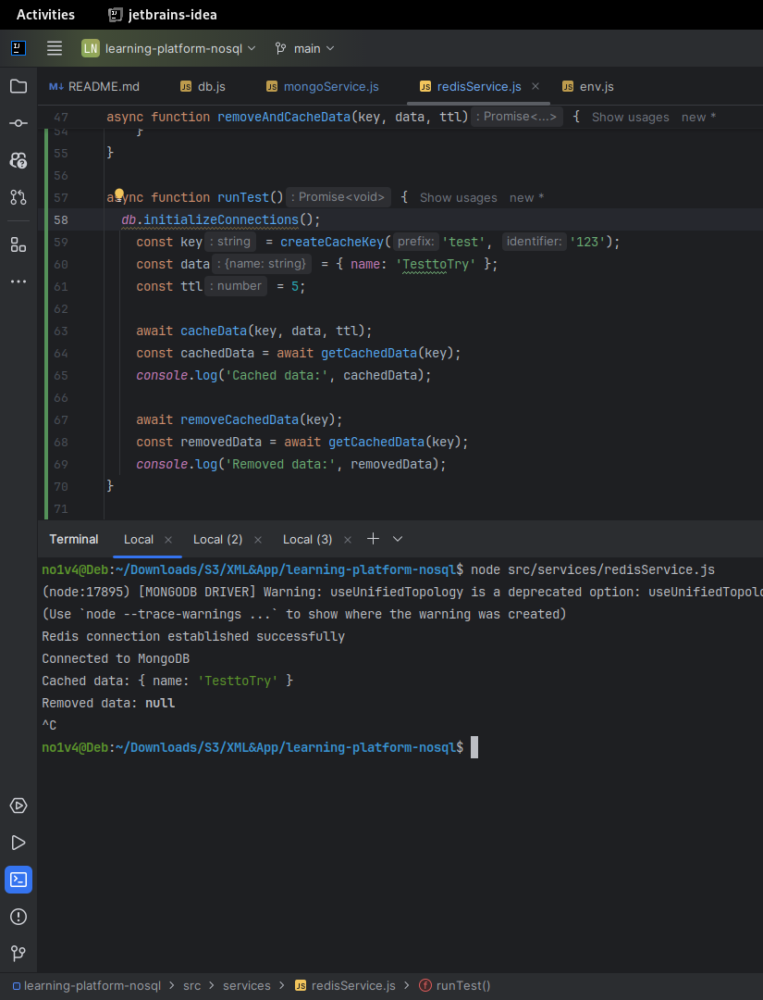
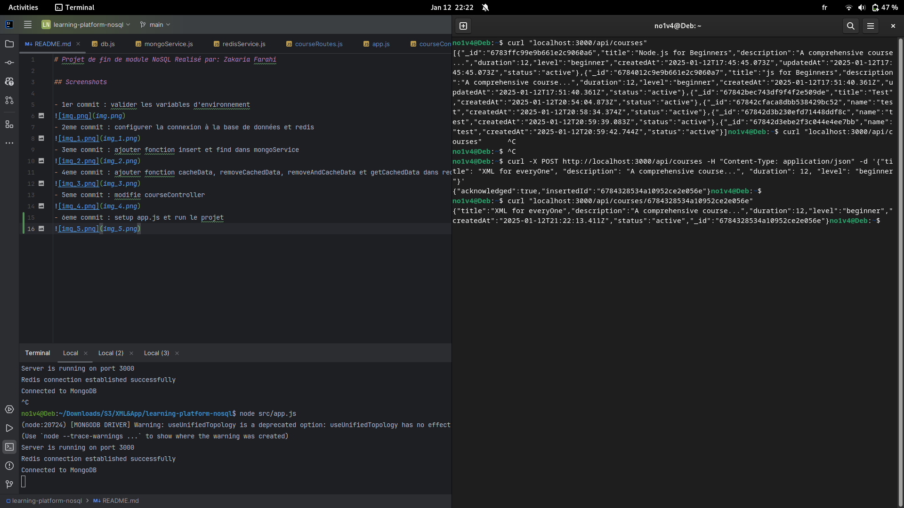

# Projet de fin de module NoSQL Realisé par: Zakaria Farahi

## Questions et réponses

### app.js
- Question: Comment organiser le point d'entrée de l'application ?
  - Réponse : utilisant un fichier app.js qui organise le démarrage de l'application
- Question: Quelle est la meilleure façon de gérer le démarrage de l'application ?
  - Réponse : en utilisant une fonction qui gere l'intialisation des connexions et le démarrage du serveur

### config/db.js
- Question : Pourquoi créer un module séparé pour les connexions aux bases de données ?
  - Réponse : faciliter la réutilisation et la gestion des connexions
- Question : Comment gérer proprement la fermeture des connexions ?
  - Réponse : ajouter fonction close() pour fermer les connexions

### config/env.js
- Question: Pourquoi est-il important de valider les variables d'environnement au démarrage ?
  - Réponse : pour eviter les erreurs de configuration
- Question: Que se passe-t-il si une variable requise est manquante ?
  - Réponse : le programme ne fonctionnera pas

### services/mongoService.js
- Question: Pourquoi créer des services séparés ?
  - Réponse: pour faciliter la réutilisation et la gestion des connexions

### services/redisService.js
- Question : Comment gérer efficacement le cache avec Redis ?
  - Réponse : en utilisant les fonctions de cacheData
- Question: Quelles sont les bonnes pratiques pour les clés Redis ?
  - Réponse : les clés Redis doivent être uniques et significatives

### controllers/courseController.js
- Question: Quelle est la différence entre un contrôleur et une route ?
  - Réponse: Un contrôleur contient la logique métier par contre route définit les points d'entrée de l'API.
- Question : Pourquoi séparer la logique métier des routes ?
  - Réponse : pour rendre le code plus modulaire

### routes/courseRoutes.js
- Question: Pourquoi séparer les routes dans différents fichiers ?
  - Réponse : pour organiser et structurer le code
- Question : Comment organiser les routes de manière cohérente ?
  - Réponse: par fonctionnalité

## Screenshots
 
- 1er commit : valider les variables d'environnement

- 2eme commit : configurer la connexion à la base de données et redis

- 3eme commit : ajouter fonction insert et find dans mongoService

- 4eme commit : ajouter fonction cacheData, removeCachedData, removeAndCacheData et getCachedData dans redisService

- 5eme commit : modifie courseController

- 6eme commit : setup app.js et run le projet
