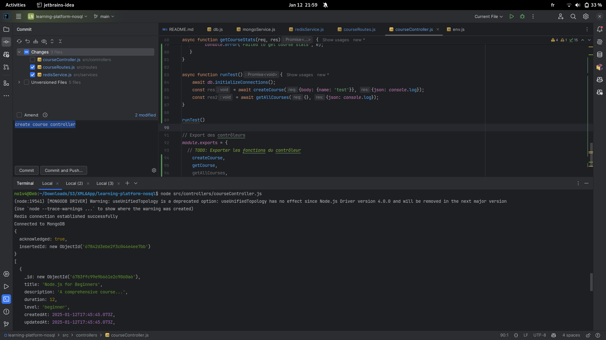

# Projet de fin de module NoSQL Realisé par: Zakaria Farahi

## Screenshots
 
- 1er commit : valider les variables d'environnement

- 2eme commit : configurer la connexion à la base de données et redis

- 3eme commit : ajouter fonction insert et find dans mongoService

- 4eme commit : ajouter fonction cacheData, removeCachedData, removeAndCacheData et getCachedData dans redisService

- 5eme commit : modifie courseController

- 6eme commit : setup app.js et run le projet
